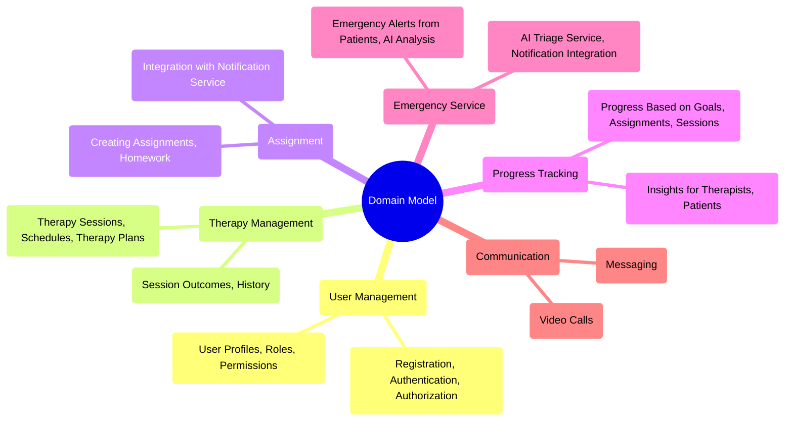

# Psychotherapy Tools Platform  

## Overview  
This project is a microservices-based system designed to support psychotherapists and their patients. The platform is built on top of the DAPR stack, leveraging .NET for backend services and Aspire for local development.  

## Features  

### For Therapists  
- **Patient Dashboard**: Track patient progress, view assignments, and monitor engagement metrics.  
- **Assignment Management**: Create and assign therapeutic exercises tailored to individual patient needs.  
- **Session Preparation**: One-click AI-powered session preparation reports with talking points and exercise suggestions.  
- **Crisis Monitoring**: Receive alerts when patients report distress and view AI-suggested responses.  
- **Progress Tracking**: Monitor patient engagement and improvement through gamification metrics.  

### For Patients  
- **Guided Exercises**: Access breathing exercises, journaling prompts, cognitive restructuring, and more.  
- **Crisis Support**: Get immediate AI-powered support for emotional distress with therapist notifications.  
- **Gamification**: Earn points, badges, and track streaks to maintain engagement with therapeutic activities.  
- **Session Management**: View upcoming sessions and review past session notes.  
- **Progress Visualization**: See improvement through visual indicators and achievement tracking.  

### 🧠 AI-Enhanced Features  
- **Session Summarization**: Automatically generate concise summaries of session notes.  
- **Handwriting Recognition**: Convert handwritten notes to text using advanced AI vision capabilities.  
- **Crisis Pattern Analysis**: Identify patterns in crisis reports to inform treatment strategies.  
- **Cognitive Restructuring Guidance**: AI-guided support for reframing negative thoughts.  
- **Personalized Session Preparation**: Generate tailored talking points based on patient history.  

This platform aims to enhance therapeutic outcomes and streamline workflows for both therapists and patients through cutting-edge technology. 

## Domain

The application follows the following domain model:

